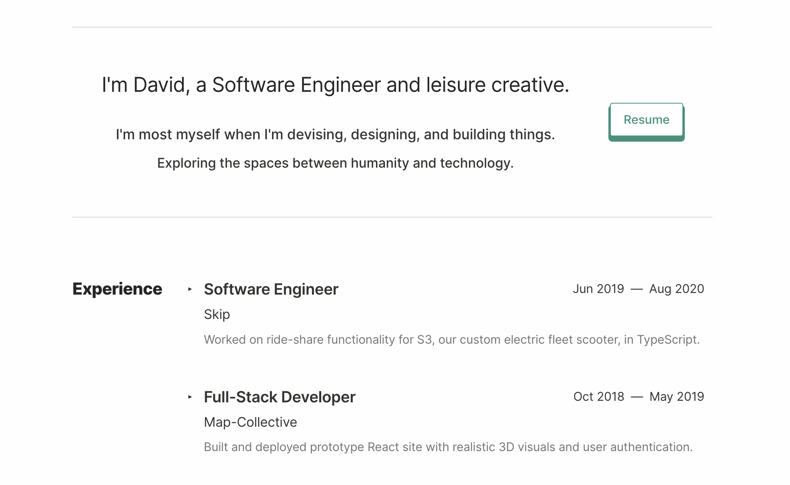

# Personal Site v3

This is v3 of my personal website, hosted on [Oasiris.github.io](https://oasiris.github.io/). It was created in TypeScript and Preact.

## Getting Started

-   `npm install`: Installs dependencies

-   `npm run dev`: Run a development, HMR server

-   `npm run serve`: Run a production-like server

-   `npm run build`: Production-ready build

-   `npm run lint`: Pass TypeScript files using ESLint

(For detailed explanation on how things work, see the [Preact CLI Readme](https://github.com/developit/preact-cli/blob/master/README.md).)
